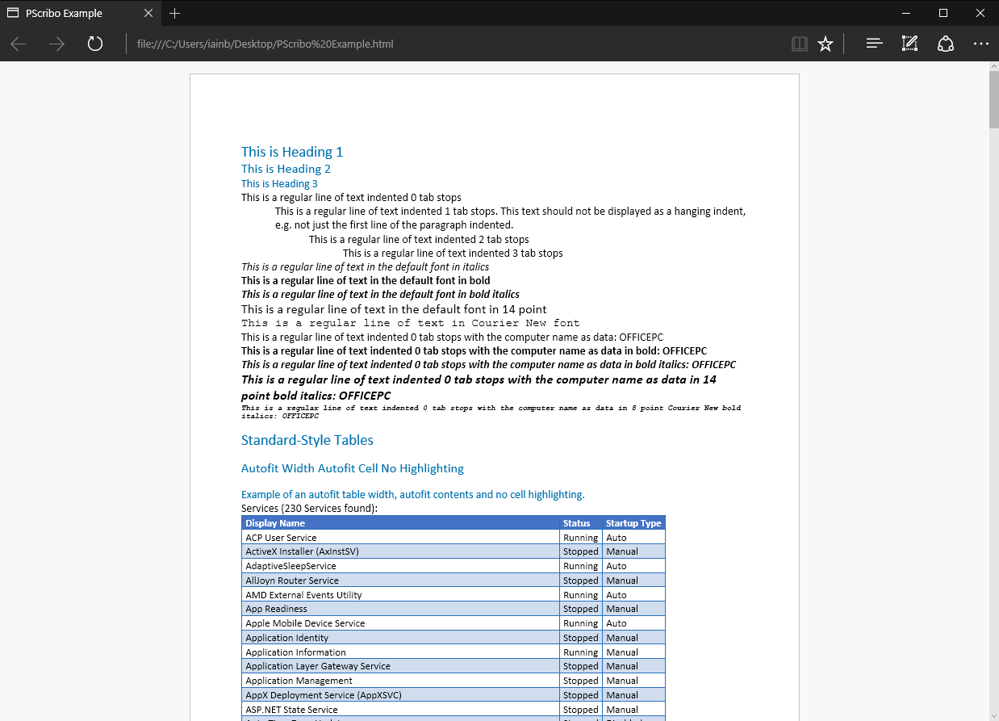
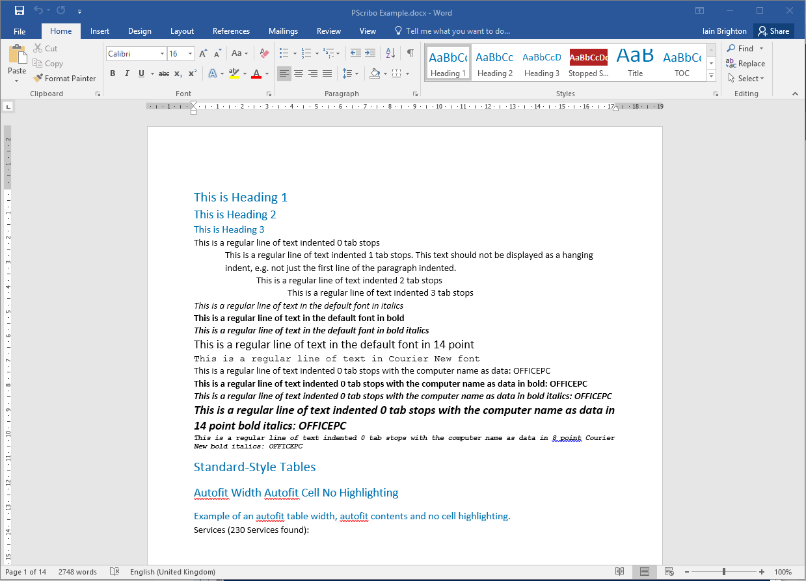
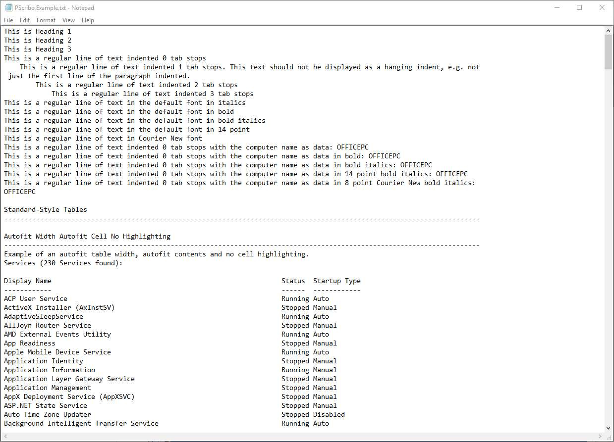

[](https://ci.appveyor.com/project/iainbrighton/pscribo)


# PScribo (Preview) #

_PScribo_ (pronounced 'skree-bo') is an open-source project that implements a documentation domain-specific language
(DSL) for PowerShell (Core) and Windows PowerShell, used to create a "document" in a standardised format. The resulting "document" can be
exported into various formats by "plugins", for example, text, HTML, XML and/or Microsoft Word format.

PScribo provides a set of functions that make it easy to create a document-like structure within Powershell scripts
without having to be concerned with handling output formatting or supporting multiple output formats.

## Authoring Example ##

```powershell
Import-Module PScribo

Document 'PScribo Example' {

    Paragraph -Style Heading1 'This is Heading 1'
    Paragraph -Style Heading2 'This is Heading 2'
    Paragraph -Style Heading3 'This is Heading 3'
    Paragraph 'This is a regular line of text indented 0 tab stops'
    Paragraph -Tabs 1 'This is a regular line of text indented 1 tab stops. This text should not be displayed as a hanging indent, e.g. not just the first line of the paragraph indented.'
    Paragraph -Tabs 2 'This is a regular line of text indented 2 tab stops'
    Paragraph -Tabs 3 'This is a regular line of text indented 3 tab stops'
    Paragraph 'This is a regular line of text in the default font in italics' -Italic
    Paragraph 'This is a regular line of text in the default font in bold' -Bold
    Paragraph 'This is a regular line of text in the default font in bold italics' -Bold -Italic
    Paragraph 'This is a regular line of text in the default font in 14 point' -Size 14
    Paragraph 'This is a regular line of text in Courier New font' -Font 'Courier New'
    Paragraph "This is a regular line of text indented 0 tab stops with the computer name as data: $env:COMPUTERNAME"
    Paragraph "This is a regular line of text indented 0 tab stops with the computer name as data in bold: $env:COMPUTERNAME" -Bold
    Paragraph "This is a regular line of text indented 0 tab stops with the computer name as data in bold italics: $env:COMPUTERNAME" -Bold -Italic
    Paragraph "This is a regular line of text indented 0 tab stops with the computer name as data in 14 point bold italics: $env:COMPUTERNAME" -Bold -Italic -Size 14
    Paragraph "This is a regular line of text indented 0 tab stops with the computer name as data in 8 point Courier New bold italics: $env:COMPUTERNAME" -Bold -Italic -Size 8 -Font 'Courier New'

    PageBreak

    $services = Get-CimInstance -ClassName Win32_Service | Select-Object -Property DisplayName, State, StartMode | Sort-Object -Property DisplayName

    Style -Name 'Stopped Service' -Color White -BackgroundColor Firebrick -Bold

    Section -Style Heading1 'Standard-Style Tables' {
        Section -Style Heading2 'Autofit Width Autofit Cell No Highlighting' {
            Paragraph -Style Heading3 'Example of an autofit table width, autofit contents and no cell highlighting.'
            Paragraph "Services ($($services.Count) Services found):"
            $services | Table -Columns DisplayName,State,StartMode -Headers 'Display Name','Status','Startup Type' -Width 0
        }
    }

    PageBreak

    Section -Style Heading2 'Full Width Autofit Cell Highlighting' {
        Paragraph -Style Heading3 'Example of a full width table with autofit columns and individual cell highlighting.'
        Paragraph "Services ($($services.Count) Services found):"
        <# Highlight individual cells with "StoppedService" style where state = stopped and startup = auto #>
        $stoppedAutoServicesCell = $services.Clone()
        $stoppedAutoServicesCell | Where { $_.State -eq 'Stopped' -and $_.StartMode -eq 'Auto'} | Set-Style -Property State -Style StoppedService
        $stoppedAutoServicesCell | Table -Columns DisplayName,State,StartMode -Headers 'Display Name','Status','Startup Type' -Tabs 1
    }

} | Export-Document -Path ~\Desktop -Format Word,Html,Text -Verbose
```

For more detailed infomation on the documentation DSL, see
[about_PScriboDocument](https://raw.githubusercontent.com/iainbrighton/PScribo/dev/en-US/about_PScriboDocument.help.txt). For more detailed examples, see
[about_PScriboExamples](https://raw.githubusercontent.com/iainbrighton/PScribo/dev/en-US/about_PScriboExamples.help.txt)


PScribo can export documentation in a variety of formats and currently supports creation of text, xml, html and Microsoft Word formats. For more detailed infomation on the plugins and output customisations, see
[about_PScriboPlugins](https://raw.githubusercontent.com/iainbrighton/PScribo/dev/en-US/about_PScriboPlugins.help.txt).

### Example Html Output ###



[Example Html Document Download](https://raw.githubusercontent.com/iainbrighton/PScribo/dev/PScriboExample.html)

### Example Word Output ###



[Example Word Document Download](https://raw.githubusercontent.com/iainbrighton/PScribo/dev/PScriboExample.docx)

### Example Text Output ###



[Example text Document Download](https://raw.githubusercontent.com/iainbrighton/PScribo/dev/PScriboExample.txt)

If you find it useful, unearth any bugs or have any suggestions for improvements,
feel free to add an [issue](https://github.com/iainbrighton/PScribo/issues) or
place a comment at the project home page.

## Installation ##

The _PScribo_ __preview__ is currently available as a Powershell module in the
[PowerShell gallery](https://www.powershellgallery.com/items?q=pscribo) and requires __Powershell 3.0__ or later. PScribo is supported on both Windows PowerShell and PowerShell Core (including Linux and macOS support).

* Automatic (via PowerShell Gallery)

  * Run `Install-Module PScribo`.
  * Run `Import-Module PScribo`.
* Manual

  * Download and unblock the latest .zip file.
  * Extract the .zip into your $PSModulePath, e.g. `~\Documents\WindowsPowerShell\Modules\`.
  * Ensure the extracted folder is named `PScribo`.
  * Run 'Import-Module `PScribo`.

For an introduction to the PScribo framework, you can view the presentation given at the
[PowerShell Summit Europe 2015](https://www.youtube.com/watch?v=pNIC70bjBZE).
